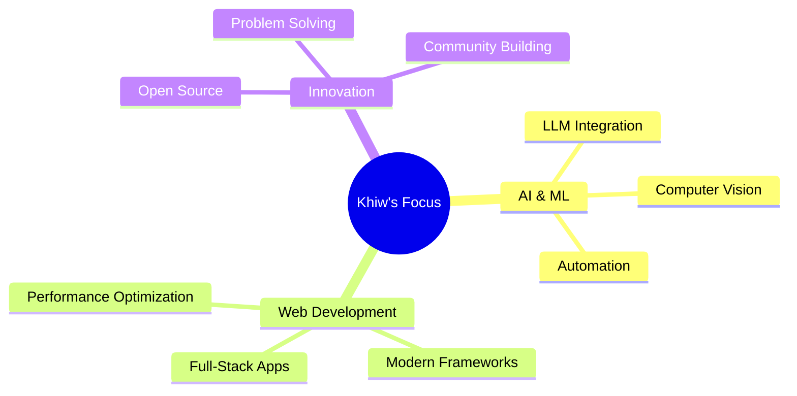

<div align="center">

# 🚀 Hey there! I'm Khiw Nitithadachot 


<p align="center">
  
  
</p>

</div>

---

## 🎯 About Me

```typescript
const khiw = {
    name: "Khiw Nitithadachot",
    role: "AI & Full-Stack Developer",
    location: "🌍 Building from anywhere",
    passions: ["AI/ML", "Web Development", "Automation", "Innovation"],
    currentFocus: "Building intelligent systems that make a difference",
    funFact: "I turn coffee into code and ideas into reality ☕→💻"
};
```

<div align="center">

## 🛠️ Tech Arsenal

### Languages & Frameworks


### AI & Machine Learning


### Cloud & DevOps


</div>

---

## 🌟 Featured Projects

<div align="center">

### 🍽️ BiteBase Intelligence
> **AI-Powered Restaurant Discovery Platform**
> 
> A comprehensive ecosystem for restaurant discovery with AI agents, geospatial analysis, and intelligent recommendations.

[](https://github.com/khiwniti/beta-bitebase-app)

---

### 🤖 AI Computer Use
> **Autonomous AI Control System**
> 
> An integrated AI control system combining local Windows automation with remote sandbox capabilities.

[](https://github.com/khiwniti/ai-computer-use)

---

### 🧠 Kaggle LLM API
> **Comprehensive LLM Solution**
> 
> Running Ollama/vLLM API servers in Kaggle notebooks with OpenAI-compatible endpoints.

[](https://github.com/khiwniti/kaggle-llm-api)

---

### 🎨 FirstPage Template
> **Stunning Landing Page Template**
> 
> Your gateway to the web - a modern, responsive first page template with performance optimization.

[](https://github.com/khiwniti/firstpage)

</div>

---

## 📊 GitHub Analytics

<div align="center">


</div>

<div align="center">


</div>

---

## 🏆 GitHub Achievements

<div align="center">


</div>

---

## 🎯 Current Focus Areas

<div align="center">



</div>

---

## 📈 Contribution Graph

<div align="center">


</div>

---

## 🌐 Let's Connect!

<div align="center">

[](https://github.com/khiwniti)
[](https://linkedin.com/in/khiwniti)
[](https://twitter.com/khiwniti)
[](mailto:khiw@example.com)

</div>

---

<div align="center">

### 💭 Random Dev Quote


---

### 🎵 Currently Coding To

[](https://open.spotify.com/user/khiwniti)

---


</div>

---

<div align="center">

**⭐ Star my repositories if you find them interesting!**

*"Code is like humor. When you have to explain it, it's bad." – Cory House*

</div>