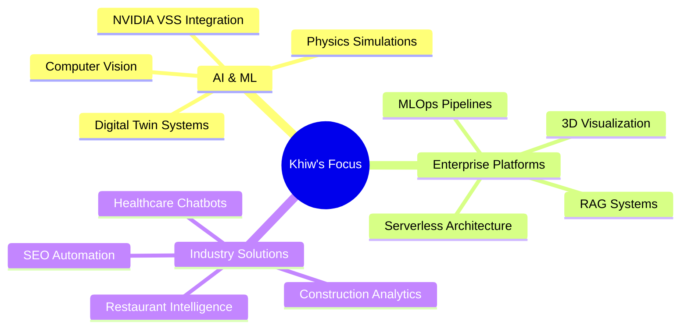

<div align="center">

# 🚀 Hey there! I'm Khiw Nitithadachot 


<p align="center">
  
  
</p>

</div>

---

## 🎯 About Me

```typescript
const khiw = {
    name: "Khiw Nitithadachot",
    role: "AI & Enterprise Solutions Developer",
    location: "🌍 Building from anywhere",
    specialties: ["NVIDIA VSS", "MLOps", "Computer Vision", "Digital Twins"],
    currentFocus: "AI-powered enterprise platforms & industry solutions",
    recentWork: ["Construction Analytics", "Physics Simulations", "Healthcare AI"],
    funFact: "Transforming industries with AI, one algorithm at a time 🤖✨"
};
```

<div align="center">

## 🛠️ Tech Arsenal

### Languages & Frameworks


### AI & Machine Learning


### Cloud & DevOps


</div>

---

## 🌟 Featured Projects

<div align="center">

### 🏗️ AsphaltTracker-NVIDIA-VSS
> **AI-Powered Construction Site Analytics**
> 
> Advanced construction site video analytics with NVIDIA VSS integration for AI-powered safety monitoring and real-time insights.

[](https://github.com/khiwniti/AsphaltTracker-NVIDIA-VSS)

---

### 🧮 PINN Enterprise Platform
> **AI-Powered Physics Simulations**
> 
> Complete serverless architecture with RAG-powered code generation, 3D visualization, and global edge deployment for physics simulations.

[](https://github.com/khiwniti/pinn-enterprise-platform)

---

### 🍽️ BiteBase Ecosystem
> **AI Restaurant Discovery Platform**
> 
> Comprehensive restaurant discovery platform with AI agents, backend API, and intelligent recommendations system.

[](https://github.com/khiwniti/beta-bitebase-app)

---

### 🤖 Simulation-Based Digital Twin
> **MLOps Digital Twin Platform**
> 
> Integrated MLOps platform for predictive asphalt tank control with NVIDIA PhysicsNeMo and advanced analytics.

[](https://github.com/khiwniti/simulation-based-digital-twin)

---

### 🩸 Bloodplusfight-TH Chatbot
> **Thai Healthcare Assistant**
> 
> Advanced chatbot assistant for Thai healthcare services with intelligent conversation capabilities.

[](https://github.com/khiwniti/Bloodplusfight-TH-chatbot-assistant)

</div>

---

## 📊 GitHub Analytics

<div align="center">


</div>

<div align="center">


</div>

---

## 🏆 GitHub Achievements

<div align="center">


</div>

---

## 🎯 Current Focus Areas

<div align="center">



</div>

---

## 📈 Contribution Graph

<div align="center">


</div>

---

## 🌐 Let's Connect!

<div align="center">

[](https://github.com/khiwniti)
[](https://linkedin.com/in/getintheq)
[](https://twitter.com/khiwniti)
[](mailto:khiwniti@getintheq.space)
</div>

---

<div align="center">

### 💭 Random Dev Quote


---

### 🎵 Currently Coding To

[](https://open.spotify.com/user/khiwniti)

---


</div>

---

<div align="center">

**⭐ Star my repositories if you find them interesting!**

*"Code is like humor. When you have to explain it, it's bad." – Cory House*

</div>
